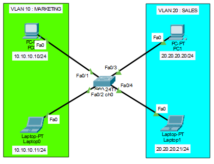
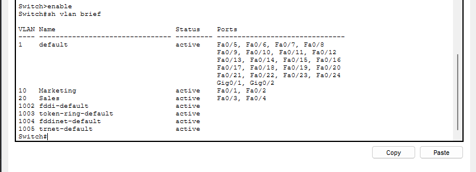
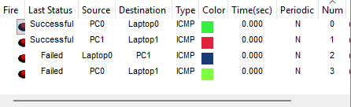

# VLAN Basic — Department Isolation

## Overview
A simple network simulation with two departments (Marketing and Sales) connected to a single physical switch, segmented using VLANs to isolate broadcast traffic between them. This project demonstrates the foundational concept of VLANs: multiple logical networks coexisting on one physical switch.

## Topology


The topology consists of:
- **1 switch** (2960-24TT)
- **2 VLANs**, each hosting one PC and one Laptop
- No trunking, no router — pure Layer 2 access-port segmentation

## Design

| VLAN | Name | Port | Device | IP Address |
|------|------|------|--------|------------|
| 10 | MARKETING | Fa0/1 | PC0 | 10.10.10.10/24 |
| 10 | MARKETING | Fa0/2 | Laptop0 | 10.10.10.11/24 |
| 20 | SALES | Fa0/3 | PC1 | 20.20.20.20/24 |
| 20 | SALES | Fa0/4 | Laptop1 | 20.20.20.21/24 |

Each VLAN uses its own /24 subnet with no overlap, and both devices in the same VLAN can communicate with each other directly at Layer 2.

## Configuration

```
Switch> enable
Switch# configure terminal

! Create VLANs
Switch(config)# vlan 10
Switch(config-vlan)# name Marketing
Switch(config-vlan)# exit

Switch(config)# vlan 20
Switch(config-vlan)# name Sales
Switch(config-vlan)# exit

! Assign Marketing ports
Switch(config)# interface fa0/1
Switch(config-if)# switchport mode access
Switch(config-if)# switchport access vlan 10
Switch(config-if)# exit

Switch(config)# interface fa0/2
Switch(config-if)# switchport mode access
Switch(config-if)# switchport access vlan 10
Switch(config-if)# exit

! Assign Sales ports
Switch(config)# interface fa0/3
Switch(config-if)# switchport mode access
Switch(config-if)# switchport access vlan 20
Switch(config-if)# exit

Switch(config)# interface fa0/4
Switch(config-if)# switchport mode access
Switch(config-if)# switchport access vlan 20
Switch(config-if)# exit

Switch(config)# end
Switch# copy running-config startup-config
```

## Verification

```
Switch# show vlan brief
```


Confirms Fa0/1 and Fa0/2 belong to VLAN 10 (Marketing), and Fa0/3 and Fa0/4 belong to VLAN 20 (Sales).

### Connectivity test



## Key Takeaway
A single physical switch can be logically divided into multiple isolated broadcast domains using VLANs. Devices in different VLANs cannot communicate without a Layer 3 device (router or Layer 3 switch) to route between them — this limitation is intentional at this stage and will be addressed in a later project covering trunking and inter-VLAN routing.

## Files
- [topology.pkt](VLAN.pkt) — Packet Tracer project file